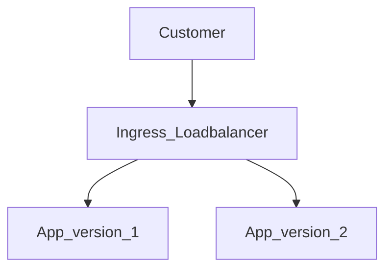

The purpose of this repository is to serve as a walkthrough for the followings:

1. Install Kubernetes Cluster
2. Deploying Calico CNI
3. Deploying multiple versions of the application
4. Split traffic between those two applications.

The Traffic Split looks something like:



While not shown in the diagram, the split is with the ratio of 70:30 for App_version_1:App_version_2. 
70% traffic will go to Application Version 1.
30% traffic will go to Application Version 1.

#Appications and Versions used:


| Applications  | Version |
| ------------- | ------------- |
| Kubernetes  | 1.27.3  |
| Docker  | 24.0.2  |
| Helm  | 3 |
| CentOS  | 7 (minimal installation)  |
| Calico  | 3.26.1 |
| Traefik  | 2.10.1 |
| Python  | 3.6 |
| Ansible  | 2.9 |

#Important Decision Regarding Disabling Firewalld:

I understand disabling firewalld is not the right approach, but it is a pre-requisites for Calico so that firewalld does not interfere with rules added by Calico. 
If a host firewall is needed, Calico can be used for the same.  It can be configured by Calico HostEndpoint and GlobalNetworkPolicy. 

#Installing the stack:

```
[root@kubesys ~]# git clone https://github.com/shkatara/traefik-split-applications.git
[root@kubesys ~]# git checkout IAC_Automation 
[root@kubesys ~]# ansible-playbook site.yml

```

#Test the application Ingresses.
Once the application is deployed after completely running the site.yml, and traefik is installed, by default in the simplest configuration, it creates a LoadBalancer type of service and exposes ports for port 80 and 443 on the node. So, when we are routing traffic to the ingress using URLs, we need to append the port number of the service for HTTP. 


```bash
[root@kubesys ~]#  export web_port=$(kubectl  get svc traefik -o jsonpath='{.spec.ports[0].nodePort}')
[root@kubesys ~]#  curl version1.trivago.apps.com:$web_port
I am version v1!
[root@kubesys ~]#  curl version2.trivago.apps.com:$web_port
I am version v2!
```

#Splitting Traffic between two application versions.
We will be using Traefik Proxy to split traffic between two different applications. This lets us split traffic without having to go through the overhead of istio or any other service mesh. 

There are two resources we will deploy to work with splitting the traffic between two services with Traefik:
1. TraefikService: TraefikService is an API resource in Kubernetes that is an implementation of traefik service. With traefik service resource, we can implement load balancing to balance the requests between multiple services based on weights. 
2. IngressRoute: The Ingress Route is incharge of connecting incoming requests to the services that can handle them, usually the traefiksesrvice. The IngressRoute can also  send traffic to Middleware API resource to update the request or act before forwarding the request to the service. IngressRoutes consists of routes that once are matched, we can transform or forward the request to one or more services based on http headers as well, or just plain simple round robin or weighted traffic split. 


Let us test the traffic splitting between two applications. We will send 100 requests and it should be spliiting 70% to the first application, and the rest 30% should be sent to the second application. This will prove that our goal is achieved to split the traffic

```bash
[root@kubesys ~]# for i in {1..100}; do curl version1.trivago.apps.com:$web_port 2>/dev/null; done | grep v1 | wc -l
70
[root@kubesys ~]# for i in {1..100}; do curl version1.trivago.apps.com:$web_port 2>/dev/null; done | grep v2 | wc -l
30
```

As we can see, the traffic out of 100 requests, 70 are being sent to first application and the rest 30% is being sent to the other application. Hence, we know the setup and the infrastructure is working as expected.

#Practical Working of the cluster and traffic split:

#Splitting the traffic between two services using Traefik Ingress Proxy:


#Infrastructure Monitoring with Prometheus and Grafana


